# Observabilidad

Este proyecto incluye ejemplos de observabilidad en una aplicación usando Sentry.

- Trazas
- Logs

## Como usar este proyecto

Este proyecto usa contenedores por lo que necesitará tener instalado Docker. **Puede abrir el proyecto usando `dev-containers` en Visual Code**, o seguir los pasos a continuación para ejecutar la aplicación.

1. Genere las imágenes de los contenedores con compose usando el comando

   ```bash
   docker compose build
   ```

1. Inicie la aplicación usando

   ```bash
   docker compose up -d
   ```

1. Cuando termine puede detener los servicios usando

   ```bash
   docker compose down
   ```

La aplicación esta compuesta por varios servicios: 

```mermaid
architecture-beta
   group frontend(cloud)[Frontend]
   group api(cloud)[Backend]
   group observability(cloud)[Observability tools]

   service react(logos:react)[Frontend] in frontend
   service flask(logos:flask)[Flask] in api
   service loki(database)[Loki] in observability
   service promtail(disk)[Promtail] in observability
   service cadvisor(logos:docker)[cAdvisor] in observability
   service prometheus(logos:prometheus)[Prometheus] in observability
   service grafana(logos:grafana)[Grafana] in observability

   react:B --> T:flask
   react:R --> L:loki
   flask:R --> L:loki
   flask:R --> L:prometheus
   loki:R --> L:promtail
   promtail:R --> L:grafana
   cadvisor:T --> B:grafana
   prometheus:R --> L:grafana
   
```



- Un [backend](backend) construido en Python con la librería Flask que expone un API REST.
- Un [frontend](frontend) web construido en Javascript con el framework React.
- [Loki](http://localhost:3100) para agregar, almacenar y consultar logs de manera eficiente.
- Promtail para recolectar logs desde diferentes fuentes y enviarlos a Loki.
- [cAdvisor](http://localhost:8080) para proporcionar información sobre el uso de recursos y el rendimiento de los contenedores.
- [Prometheus](http://localhost:9090) para recopilar métricas y datos de series temporales, y monitorear y alertar basado en estos.
- [Grafana](http://localhost:3200) para visualizar métricas y datos de series temporales a través de paneles interactivos.

> **Nota**: Debe modificar los proyectos de backend y frontend antes de iniciar los servicios usando sus propios parámetros de configuración para su cuenta de Sentry.

## Referencias

- [Grafana Loki](https://grafana.com/docs/loki/latest/)
- [Grafana Loki Promtail](https://grafana.com/docs/loki/latest/send-data/promtail/)
- [Grafana](https://grafana.com/docs/grafana/latest/)
- [cAdvisor](https://github.com/google/cadvisor)
- [Prometheus](https://prometheus.io/)